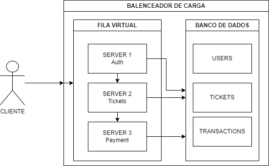

# coderbyte-test

   

	
   
  
  
  

   Made with 💖 by
    <a href="https://github.com/gustavogk"> Gustavo Assunção.
    <h1></h1>
  

# Arquitetura proposta para sistema de venda de ingressos

Esta é uma proposta de arquitetura para um sistema de venda de ingressos, projetado para lidar com alta demanda e um número limitado de ingressos, garantindo justiça, igualdade e minimizando o impacto da velocidade da internet na compra. Abaixo estão os principais componentes e o funcionamento do sistema.

## Componentes principais

- **Balanceador de carga**: Distribui o tráfego entre vários servidores, evitando sobrecarga em um único ponto.
  
- **Fila de espera virtual**: Organiza os usuários em uma fila única, independentemente da velocidade da internet.
  
- **Servidor de autenticação**: Valida as credenciais dos usuários e garante acesso à fila.
  
- **Servidor de ingressos**: Controla a disponibilidade dos ingressos e realiza a venda.
  
- **Servidor de pagamento**: Processa os pagamentos dos ingressos.
  
- **Banco de dados**: Armazena informações sobre usuários, ingressos e transações.

## Funcionamento

1. O usuário acessa o site e é direcionado para o balanceador de carga.
   
2. O balanceador de carga direciona o usuário para o servidor de autenticação.
   
3. O usuário informa suas credenciais e, se autenticado, é direcionado para a fila de espera virtual.
   
4. Na fila, o usuário recebe uma posição estimada de espera.
   
5. Quando chegar a vez do usuário, ele é direcionado para o servidor de ingressos.
   
6. O servidor de ingressos verifica a disponibilidade do ingresso desejado e, se disponível, o reserva para o usuário.
   
7. O usuário é direcionado para o servidor de pagamento para realizar o pagamento.
   
8. Se o pagamento for bem-sucedido, o servidor de ingressos finaliza a venda e libera o ingresso para o usuário.
   
9. O usuário recebe um e-mail de confirmação com o ingresso.

## Vantagens da arquitetura proposta

- **Escalabilidade**: Suporta alto volume de acessos sem comprometer a performance.
  
- **Justiça e igualdade**: Todos os usuários têm a mesma chance de comprar ingressos, independentemente da velocidade da internet.
  
- **Transparência**: O usuário acompanha sua posição na fila e sabe quando será sua vez de comprar.
  
- **Segurança**: As informações dos usuários são protegidas por criptografia.
